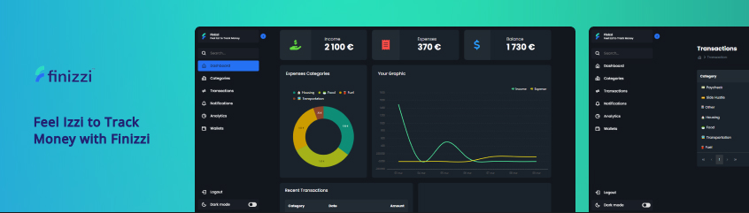

<h1 align="center"> Finizzi </h1>

<p align="center">
Feel Izzi to Track Money with Finizzi. <br/>
</p>

<p align="center">
  <a href="#-technologies">Technologies</a>&nbsp;&nbsp;&nbsp;|&nbsp;&nbsp;&nbsp;
  <a href="#-about">About</a>&nbsp;&nbsp;&nbsp;|&nbsp;&nbsp;&nbsp;
  <a href="#-layout">Layout</a>&nbsp;&nbsp;&nbsp;|&nbsp;&nbsp;&nbsp;
  <a href="#-installation">Installation</a>
</p>

<p align="center">
  
</p>

## 🚀 Technologies

This project was developed with the following technologies:

- ``ASP.NET Core MVC`` & ``Entity Framework``
- ``Microsoft SQL Server``
- ``HTML`` & ``CSS``
- ``SyncFusion Components``
- ``Git`` & ``Github``
-  ``Figma``

## 📖 About 

### Description
Finizzi is an application where you can control your spending and consumption in an Izzi way, use the application now and see how your last 7 days were!

### Objective
Learn and practice the following languages and frameworks: ASP.NET Core MVC and Entity Framework.

### Note
This App is focused in the use of the ASP.NET Core MVC and the Entity Framework, despite its unique and beautiful layout the app is built for large devices, and may not be responsive on many medium and small devices.

## 🔖 Layout

You can view the layout of the project through [in here](https://www.figma.com/file/4STnu2DgiYgE4dfyVhLXQQ/Untitled?node-id=0%3A1). You must have an account at [Figma](https://figma.com) to access it. In this case it is just a template layout because it was made after the build was complete.

## 🛠 Installation

```bash
# Open "appsettings.json" file and in the DevConnection property change "instance" to your SQL instance Server name:
{
  "Logging": {
    "LogLevel": {
      "Default": "Information",
      "Microsoft.AspNetCore": "Warning"
    }
  },
  "AllowedHosts": "*",
  "ConnectionStrings": {
    "DevConnection": "Server=(localdb)\\instance;Database=TransactionDB;Trusted_Connection=True;MultipleActiveResultSets=True;"
  }
}

# Open the Nugget Package Manager Console and add the Migration:
$ Add-Migration "Initial Create"

# Now in order to Create the Physical DataBase according to the Models execute the following command:
$ Update-Database

# Open the Microsoft SQL Server Management Studio or Visual Studio's SQL Server Object Explorer Viewer and verify if the tables were created correctly.

# Now Press the following keys to Build and Run your app without Debugging;
$ control + f5

```

## 📫 Contribute
To contribute to Finizzi, follow these steps:
1. Fork this repository.
2. Create a branch: `git checkout -b <branch_name>`.
3. Make your changes and commit them: `git commit -m '<commit_message>'`
4. Push to original branch: `git push origin <project_name> / <location>`
5. Create the pull request.
Alternatively, see the GitHub documentation at [how to create a pull request](https://help.github.com/en/github/collaborating-with-issues-and-pull-requests/creating-a-pull-request ).

## :memo: Licence

This project is licensed under the MIT license.

---

Made with ♥ by [Gonçalo Pinto](https://github.com/devgoncalo)
